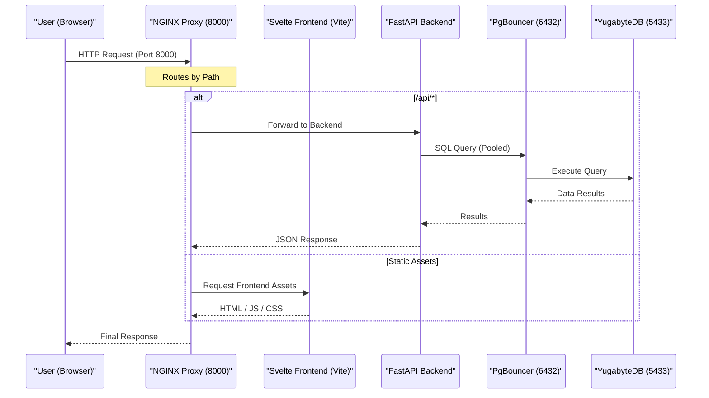
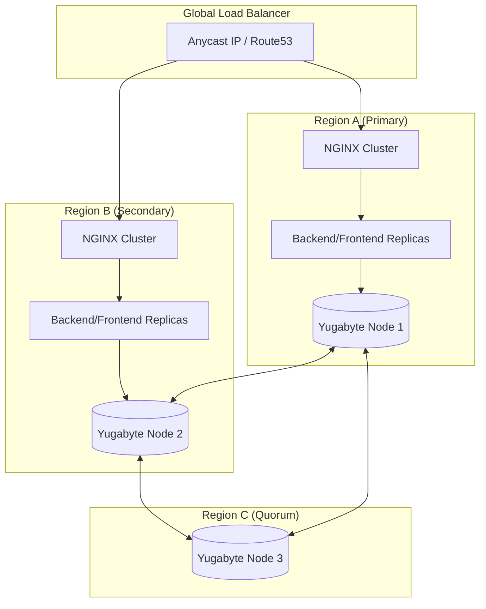
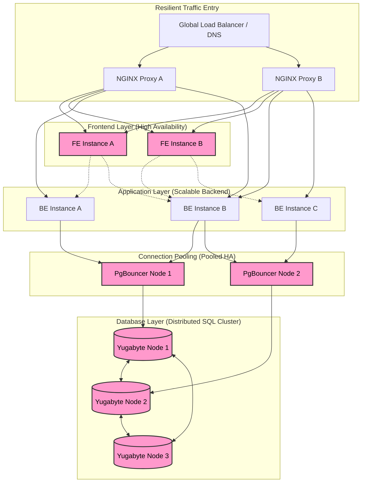
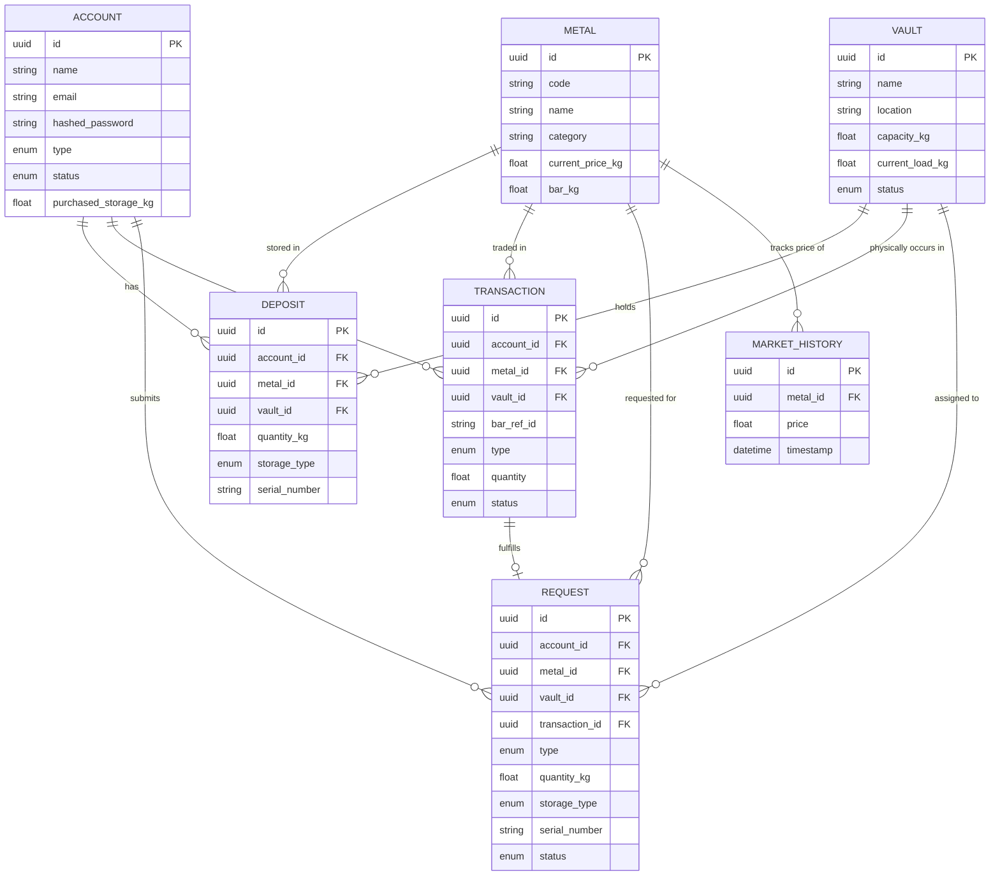

# MSE Digital Asset Custody Platform

Modern, secure, institutional-grade storage and administration utility for physical and digital assets.

## Quick Start

To get the project up and running locally, follow these steps:

1.  **Clone the Repository**:
    ```bash
    git clone https://github.com/mafuth/MSE-Customer-Inquiry-Management
    cd MSE-Customer-Inquiry-Management
    ```

2.  **Environment Setup**:
    Copy the example environment file and update any necessary values:
    ```bash
    cp .env.example .env
    ```

3.  **Start Services**:
    Use Docker Compose to build and start all containers:
    ```bash
    docker-compose up --build
    ```

4.  **Access the Application**:
    [http://localhost:8000](http://localhost:8000)

---

## Architectural Diagrams

### 1. Request Handling Flow
This diagram illustrates how a user request is handled from the browser through the proxy, application, and database layers.



---

### 2. Regional Scaling Design
The project is designed to scale horizontally across multiple regions using a Global Load Balancer and YugabyteDB's distributed SQL capabilities.



---

### 3. High Availability (HA) Standards
The architecture ensures no single point of failure by implementing redundancy and health monitoring at every layer.



---

### 4. Database Design (ERD)
The following Entity Relationship Diagram shows the core table relationships for asset management and transaction tracking.


